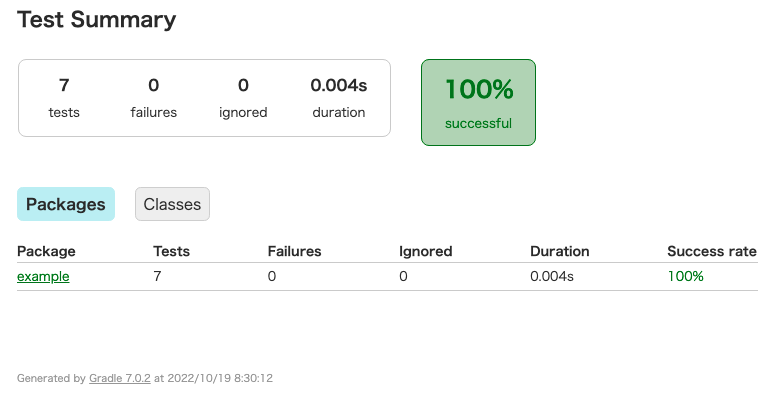

# Gradle test

## Recording test results

```sh
# Record build
$ BUILD_NAME=test
$ launchable record build --name ${BUILD_NAME} --source ..
Launchable recorded 1 commit from repository ~/launchable/samples/examples
Launchable recorded build test to workspace launchableinc/mothership with commits from 1 repository:

| Name   | Path   | HEAD Commit                              |
|--------|--------|------------------------------------------|
| ..     | ..     | dda6bed2bbcbff79c89abbb78296083ce6eaa6b5 |


# Run test
$ gradle test

Deprecated Gradle features were used in this build, making it incompatible with Gradle 8.0.
Use '--warning-mode all' to show the individual deprecation warnings.
See https://docs.gradle.org/7.0.2/userguide/command_line_interface.html#sec:command_line_warnings

BUILD SUCCESSFUL in 1s
3 actionable tasks: 1 executed, 2 up-to-date


# Record test result
$ launchable record tests --build ${BUILD_NAME} gradle ./build/test-results/test
Launchable recorded tests for build test (test session 15) to workspace launchableinc/mothership from 4 files:

|   Files found |   Tests found |   Tests passed |   Tests failed |   Total duration (min) |
|---------------|---------------|----------------|----------------|------------------------|
|             9 |             9 |              9 |              0 |                 0.0001 |

Visit https://app.launchableinc.com/organizations/launchableinc/workspaces/mothership/test-sessions/15 to view uploaded test results (or run `launchable inspect tests --test-session-id 15`)

# See test session inspection
$ launchable inspect tests --test-session-id 15
| Test Path                             |   Duration (sec) | Status   | Uploaded At                 |
|---------------------------------------|------------------|----------|-----------------------------|
| class=example.MulTest#testcase=calc   |            0     | SUCCESS  | 2022-10-18T23:25:33.025527Z |
| class=example.DB0Test#testcase=calc   |            0.004 | SUCCESS  | 2022-10-18T23:25:33.025527Z |
| class=example.Add2Test#testcase=calc  |            0     | SUCCESS  | 2022-10-18T23:25:33.025527Z |
| class=example.DB1Test#testcase=calc   |            0     | SUCCESS  | 2022-10-18T23:25:33.025527Z |
| class=example.AddTest#testcase=calc   |            0     | SUCCESS  | 2022-10-18T23:25:33.025527Z |
| class=example.DivTest#testcase=calc   |            0     | SUCCESS  | 2022-10-18T23:25:33.025527Z |
| class=example.File0Test#testcase=calc |            0.001 | SUCCESS  | 2022-10-18T23:25:33.025527Z |
| class=example.File1Test#testcase=calc |            0.001 | SUCCESS  | 2022-10-18T23:25:33.025527Z |
| class=example.SubTest#testcase=calc   |            0     | SUCCESS  | 2022-10-18T23:25:33.025527Z |
```

You can see your test report in `build/reports/tests/test/index.html`.


---

## Subsetting your test runs

```sh
$ BUILD_NAME=test
$ CONFIDENCE="80%"


# Request subset of test up to 50%.
$ launchable subset --target ${CONFIDENCE} --build ${BUILD_NAME} gradle src/test/java > subset.txt
Your model is currently in training
Launchable created subset 17 for build test (test session 15) in workspace launchableinc/mothership

|           |   Candidates |   Estimated duration (%) |   Estimated duration (min) |
|-----------|--------------|--------------------------|----------------------------|
| Subset    |            7 |                  77.7778 |                0.000116667 |
| Remainder |            2 |                  22.2222 |                3.33333e-05 |
|           |              |                          |                            |
| Total     |            9 |                 100      |                0.00015     |

Run `launchable inspect subset --subset-id 17` to view full subset details


# Inspect subset
$ launchable inspect subset --subset-id 17
|   Order | Test Path               | In Subset   |   Estimated duration (sec) |
|---------|-------------------------|-------------|----------------------------|
|       1 | class=example.SubTest   | ✔           |                      0.001 |
|       2 | class=example.DivTest   | ✔           |                      0.001 |
|       3 | class=example.DB0Test   | ✔           |                      0.001 |
|       4 | class=example.File1Test | ✔           |                      0.001 |
|       5 | class=example.File0Test | ✔           |                      0.001 |
|       6 | class=example.DB1Test   | ✔           |                      0.001 |
|       7 | class=example.MulTest   | ✔           |                      0.001 |
|       8 | class=example.AddTest   |             |                      0.001 |
|       9 | class=example.Add2Test  |             |                      0.001 |


# What is recorded in subset text.
$ cat subset.txt
--tests example.SubTest --tests example.DivTest --tests example.DB0Test --tests example.File1Test --tests example.File0Test --tests example.DB1Test --tests example.MulTest


# Run subset of test
$ gradle test $(cat subset.txt)

Deprecated Gradle features were used in this build, making it incompatible with Gradle 8.0.
Use '--warning-mode all' to show the individual deprecation warnings.
See https://docs.gradle.org/7.0.2/userguide/command_line_interface.html#sec:command_line_warnings

BUILD SUCCESSFUL in 1s
3 actionable tasks: 3 executed
```

You can see your test report in `build/reports/tests/test/index.html`.



## Split subset for parallel test runs

```sh
# Apply `--split` option to split the subset into multiple bins to run simultaneously in parallel test environment.
$ launchable subset --target ${CONFIDENCE} --build ${BUILD_NAME} --split gradle src/test/java
subset/38
Your model is currently in training
Launchable created subset 38 for build test (test session 27) in workspace launchableinc/mothership

|           |   Candidates |   Estimated duration (%) |   Estimated duration (min) |
|-----------|--------------|--------------------------|----------------------------|
| Subset    |            7 |                  77.7778 |                0.000116667 |
| Remainder |            2 |                  22.2222 |                3.33333e-05 |
|           |              |                          |                            |
| Total     |            9 |                 100      |                0.00015     |

Run `launchable inspect subset --subset-id 38` to view full subset details


# Request for splitted test bin of 1/2.
$ launchable split-subset --subset-id subset/38 --bin 1/2 gradle
--tests example.SubTest --tests example.MulTest --tests example.File0Test --tests example.DB0Test

# Request for splitted test bin of 2/2.
$ launchable split-subset --subset-id subset/38 --bin 2/2 gradle
--tests example.DB1Test --tests example.DivTest --tests example.File1Test


# Let's say these tests access the same external data, and you do not want them to run concurrently.
# Both DB0Test and DB1Test access the same record A.
# Both File0Test and File1Test access the same file X.
# In order to avoid running these tests concurrently in parallel test, you need to place the tests in the same subset to run them sequentially.
# We have `--same-bin` option to make it work.
# First, write tests that you want to run sequentially in a text file.
$ cat same_bin0.txt
example.DB0Test
example.DB1Test

$ cat same_bin1.txt
example.File0Test
example.File1Test

# Run `split-subset` request with `--same-bin` option.
$ launchable split-subset \
    --subset-id subset/38 \
    --bin 1/2 \
    --same-bin same_bin0.txt \
    --same-bin same_bin1.txt \
    gradle
--tests example.File1Test --tests example.File0Test --tests example.MulTest --tests example.DivTest

$ launchable split-subset \
    --subset-id subset/38 \
    --bin 2/2 \
    --same-bin same_bin0.txt \
    --same-bin same_bin1.txt \
    gradle
--tests example.DB0Test --tests example.DB1Test --tests example.SubTest

# As you can see, the grouped tests, DB0Test and DB1Test, and File0Test and File1Test, are in same bins.

# !!!`--same-bin` option is currently supported only for gradle test and go-test.!!!
```